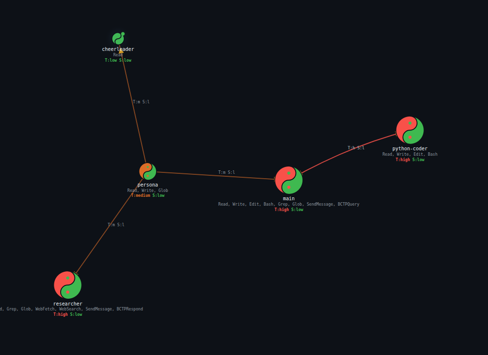

# TriOnyx

[](https://elixir-lang.org)
[](https://python.org)
[](https://docker.com)
[](LICENSE)

**Track what agents see, not just what they do.**

A security-first agent runtime that tracks **information flow** between isolated LLM agents. Taint tracking, sensitivity labels, and bandwidth-constrained communication — built on Elixir/OTP for a single operator running their own agents.

<p>
  <a href="https://tri-onyx.com"><strong>Documentation</strong></a>&nbsp;&nbsp;|&nbsp;&nbsp;<a href="https://tri-onyx.com/getting-started/"><strong>Getting Started</strong></a>&nbsp;&nbsp;|&nbsp;&nbsp;<a href="https://tri-onyx.com/api-reference/"><strong>API Reference</strong></a>
</p>

---

## The lethal trifecta

The term comes from [Simon Willison's "The Lethal Trifecta"](https://simonwillison.net/2025/Jun/16/the-lethal-trifecta/) — the observation that AI agents become critically dangerous when they combine access to private data, exposure to untrusted content, and the ability to communicate externally. TriOnyx was built to address this directly.

Other agent runtimes sandbox **capability** — restrict filesystem, disable shell, limit network. This misses the point. The real danger isn't any single property. It's the combination of three:

> **Untrusted content** — web pages, emails, API responses carrying prompt injections
>
> \+ **Sensitive information** — credentials, private files, internal APIs
>
> \+ **Capabilities** — shell access, file writes, inter-agent messaging
>
> \= **High-risk agent** — TriOnyx tracks *information flow*, not just capability, blocking tainted data from reaching sensitive resources

---

## Features

**Security & information flow**
- **Taint tracking** — Biba integrity model tracks what each agent has been exposed to
- **Sensitivity labels** — Bell-LaPadula confidentiality tracks access to secrets and private data
- **Information flow enforcement** — the gateway intercepts all inter-agent messages and blocks policy violations
- **Bandwidth-Constrained Protocol** — tainted agents communicate with clean agents through structured, human-approvable formats

**Isolation & sandboxing**
- **Isolated containers** — each agent runs in its own Docker container with per-agent repo mounts, network rules, and no shared state
- **Per-agent git repositories** — each agent owns a git repo mounted read-write at `/workspace`; shared repos mount read-only or read-write at `/repos/<name>`. The mount set *is* the ACL — no in-container policy engine
- **Gateway-only git** — working trees contain no `.git`; the gateway commits each session's changes with taint/sensitivity provenance trailers

**Runtime**
- **Browser sessions** — headless Chromium with persistent login sessions from the host
- **Plugin system** — reusable agent extensions that live inside an agent's own repo or a shared repo
- **Auditable everything** — structured logs for file access, tool calls, message routing, and policy violations



---

## Architecture

```
            External Triggers (webhooks, chat, cron, email)
                            |
                            v
+----------------------------------------------+
|             Elixir/OTP Gateway               |
|  Non-agentic. No LLM. Deterministic policy.  |
+-------------+----------------+---------------+
              |                |
              v                v
+---------------+  +---------------+     +-------------+
| Agent A       |  | Agent B       |     | Connector   |
| Python+Claude |  | Python+Claude |     | Matrix      |
| repo mounts   |  | repo mounts   |     +-------------+
+---------------+  +---------------+
```

See the [full architecture docs](https://tri-onyx.com/agent-runtime/) for details.

---

## Quick start

### Prerequisites

- Docker

### Build

```bash
# Gateway image (Elixir/OTP)
docker build -f gateway.Dockerfile -t tri-onyx-gateway:latest .

# Agent runtime image (Python + Claude SDK)
docker build -f agent.Dockerfile -t tri-onyx-agent:latest .

# Connector image (Python, for Matrix chat bridge)
docker build -f connector.Dockerfile -t trionyx-connector:latest .
```

### Run

```bash
docker compose up
```

### Test

```bash
# Elixir gateway tests
docker run --rm -v $(pwd):/app -w /app tri-onyx-gateway:latest mix test

# Python connector tests
docker run --rm -v $(pwd)/connector:/app -w /app trionyx-connector:latest uv run pytest
```

---

## Agent definitions

Agents are defined as markdown files with YAML frontmatter in the shared `definitions` repo (seeded from `workspace.template/` on first gateway start):

```markdown
---
name: code-reviewer
description: Reviews code for quality, security, and style
model: claude-sonnet-4-20250514
tools: Read, Grep, Glob
network: none
repos_read:
  - knowledge
  - agents/main
skills: code-review-standards, security-checklist
browser: false
---

You are a code reviewer. Your own repo is mounted read-write at /workspace;
repos listed in repos_read are mounted read-only under /repos/.
```

The frontmatter declares permissions (tools, repo mounts, network policy, browser access). The body is the system prompt. The gateway translates these into Docker container configuration, per-repo bind mounts, and iptables rules — the mount set *is* the filesystem ACL.

---

## Documentation

Full documentation is available at **[tri-onyx.com](https://tri-onyx.com)**:

- [Getting Started](https://tri-onyx.com/getting-started/) — complete walkthrough from clone to running agents
- [Security Model](adr/SECURITY_MODEL.md) — three-axis risk model, enforcement layers, violation detection
- [Bandwidth-Constrained Protocol](https://tri-onyx.com/bcp/) — how tainted agents communicate safely
- [Browser Sessions](https://tri-onyx.com/browser-sessions/) — persistent browser sessions for agents
- [Plugins](https://tri-onyx.com/plugins/) — plugin system and management
- [API Reference](https://tri-onyx.com/api-reference/) — full HTTP API documentation
- [Web Dashboard](https://tri-onyx.com/web-dashboard/) — monitoring and management UI
- [Comparison with OpenClaw](https://tri-onyx.com/comparison/) — detailed side-by-side
- [Architecture Decisions](https://tri-onyx.com/decisions/) — ADRs 001-012
- [Project Structure](https://tri-onyx.com/project-structure/) — full source tree reference
