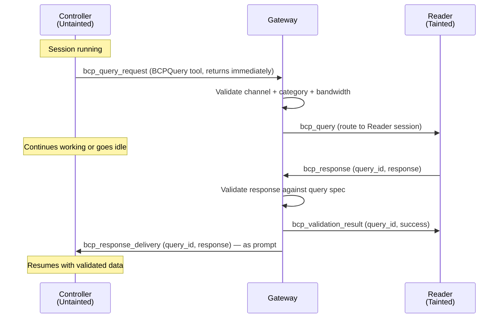
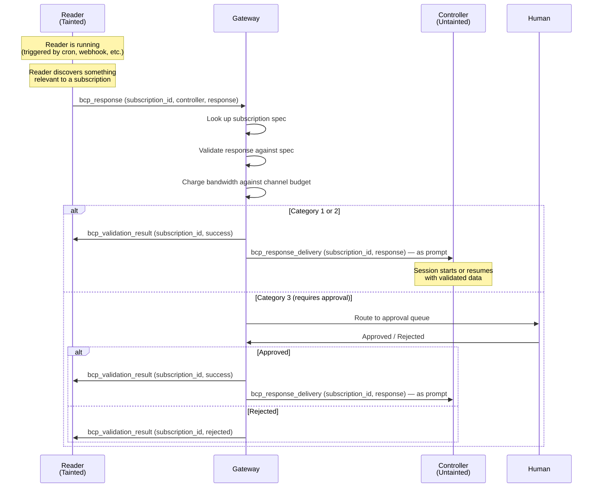

# BCP Subscriptions

Extension to the [Bandwidth-Constrained Protocol](bcp.md) that adds push-based information delivery from Reader agents to Controller agents.

!!! abstract "Design rationale"
    The base BCP protocol is pull-based: the Controller queries, the Reader responds. This works well for on-demand information needs, but forces polling when the Controller needs ongoing updates. BCP Subscriptions add a push channel where the Reader publishes data against a pre-declared spec, validated identically to query responses. The Controller defines *what* it wants; the Reader decides *when* to push.

---

## Motivation

Without subscriptions, a Controller that needs periodic updates from a Reader must:

1. Be triggered (cron, heartbeat, user message)
2. Send a BCP query
3. Wait for the Reader to respond
4. Repeat

This burns bandwidth budget on every poll cycle, requires the Controller to be running, and introduces latency between when the Reader discovers something relevant and when the Controller learns about it.

With subscriptions, the Reader pushes validated data to the Controller *when it has something to report*. The push is delivered as a prompt to the Controller's session — starting a new session if none exists, or resuming an idle one.

---

## Roles

The existing BCP roles are preserved with one behavioral extension:

**Controller (Untainted Agent):** Declares subscriptions in its agent definition. Each subscription specifies a Reader peer, a category, and a query spec defining the expected response shape. The Controller never creates subscriptions at runtime — they are static, declared by the operator.

**Reader (Tainted Agent):** Gains the ability to *initiate* data delivery via the `BCPPublish` tool. The Reader can only publish against subscriptions that exist — it cannot create subscriptions or influence their spec. The Reader still has no control over the protocol's structure; the Controller's definition is the sole authority.

!!! warning "Asymmetry preserved"
    The Controller still controls the dialogue structure. The Reader gains the ability to *push timing*, but not to define *what* gets pushed. The spec is fixed at definition time by the operator, not negotiated at runtime.

---

## Protocol Changes

This extension introduces **1 new message type** and **extends 3 existing messages** with optional fields. The subscription publish flow reuses the same validation, delivery, and taint mechanisms as the existing query-response flow.

### Design Principle: Async BCP

The base BCP query-response flow is made asynchronous. The `BCPQuery` tool returns immediately after sending the request instead of blocking for the response. The validated response arrives later as a `bcp_response_delivery` prompt — either resuming an idle Controller session or starting a new one. This is the same delivery mechanism used for subscription pushes, which unifies both flows.

| Flow | Controller sends | Response arrives as |
|---|---|---|
| Query (pull) | `bcp_query_request` via `BCPQuery` tool (returns immediately) | `bcp_response_delivery` prompt to session |
| Subscription (push) | Nothing — declared in definition | `bcp_response_delivery` prompt to session |

The only difference is the trigger: pull is initiated by the Controller at runtime, push is initiated by the Reader against a static spec. The delivery path is identical.

---

## Subscription Declaration

Subscriptions are declared inside `bcp_channels` entries in the Controller's agent definition. Only channels where `role: controller` may contain subscriptions.

### YAML Schema

```yaml
bcp_channels:
  - peer: researcher
    role: controller
    rates:
      cat1: 20/hour
      cat2: 10/hour
      cat3: 0
    subscriptions:
      - id: research-findings
        category: 2
        questions:
          - id: q1
            question: "What is the topic?"
            max_words: 10
            expected_format: short_text
          - id: q2
            question: "What is the key finding?"
            max_words: 50
            expected_format: short_text
          - id: q3
            question: "How relevant is this? (1-5)"
            max_words: 1
            expected_format: integer
      - id: research-alerts
        category: 1
        fields:
          - name: has_new_results
            type: boolean
          - name: priority
            type: enum
            values: [low, medium, high, critical]
```

### Subscription Fields

| Field | Type | Required | Description |
|---|---|---|---|
| `id` | string | yes | Unique identifier within the channel (alphanumeric + hyphens) |
| `category` | integer | yes | 1, 2, or 3 — must not exceed the channel's `max_category` |
| `fields` | array | Cat-1 | Field definitions (same schema as BCP Cat-1 queries) |
| `questions` | array | Cat-2 | Question definitions (same schema as BCP Cat-2 queries) |
| `directive` | string | Cat-3 | Summary instruction (same schema as BCP Cat-3 queries) |
| `max_words` | integer | Cat-2/3 | Word limit per answer/summary |

The spec within each subscription uses the exact same format as the corresponding BCP query category. No new validation schemas are needed.

### Constraints

- A subscription's `category` must not exceed the channel's `max_category`.
- Subscription IDs must be unique within a channel (not globally).
- The Reader's matching channel must also exist (role: reader, same peer).
- Cat-3 subscriptions always require human approval on every push, same as Cat-3 queries.

---

## Reader Awareness

When a Reader agent's session starts, the gateway checks all Controller definitions for subscriptions targeting this Reader. Active subscription specs are delivered to the Reader as part of its session context.

### New Inbound Message: `bcp_subscriptions_active`

Sent from the gateway to the Reader runtime after the `start` message, before any prompt. This is the only genuinely new message type in this extension.

```json
{
  "type": "bcp_subscriptions_active",
  "subscriptions": [
    {
      "subscription_id": "research-findings",
      "controller": "main",
      "category": 2,
      "questions": [
        {"id": "q1", "question": "What is the topic?", "max_words": 10, "expected_format": "short_text"},
        {"id": "q2", "question": "What is the key finding?", "max_words": 50, "expected_format": "short_text"},
        {"id": "q3", "question": "How relevant is this? (1-5)", "max_words": 1, "expected_format": "integer"}
      ]
    },
    {
      "subscription_id": "research-alerts",
      "controller": "main",
      "category": 1,
      "fields": [
        {"name": "has_new_results", "type": "boolean"},
        {"name": "priority", "type": "enum", "values": ["low", "medium", "high", "critical"]}
      ]
    }
  ]
}
```

| Field | Type | Description |
|---|---|---|
| `subscriptions` | array | All active subscriptions targeting this Reader |
| `subscriptions[].subscription_id` | string | Subscription ID from the Controller's definition |
| `subscriptions[].controller` | string | Name of the subscribing Controller agent |
| `subscriptions[].category` | integer | Query category (determines validation rules) |
| `subscriptions[].fields` | array | Cat-1: field definitions |
| `subscriptions[].questions` | array | Cat-2: question definitions |
| `subscriptions[].directive` | string | Cat-3: summary instruction |
| `subscriptions[].max_words` | integer | Cat-2/3: word limit |

The Reader's runtime presents these subscriptions to the LLM as available publish targets. The Reader can then decide — based on its own triggers, research results, or internal logic — when to publish.

---

## Extended Messages

### `bcp_response` — extended (Reader -> Gateway)

The existing `bcp_response` message gains two optional fields for subscription publishes. The gateway disambiguates by which identifier is present.

**Existing usage (query response):**
```json
{
  "type": "bcp_response",
  "query_id": "abc123",
  "response": {"status": "ok"}
}
```

**New usage (subscription publish):**
```json
{
  "type": "bcp_response",
  "subscription_id": "research-findings",
  "controller": "main",
  "response": {
    "q1": "Quantum computing breakthrough",
    "q2": "Google achieves 100-qubit error correction milestone",
    "q3": "4"
  }
}
```

| Field | Type | Required | Description |
|---|---|---|---|
| `query_id` | string | one of | ID of the query being responded to (existing) |
| `subscription_id` | string | these | ID of the subscription being published against (new) |
| `controller` | string | required | Name of the subscribing Controller (new, required when `subscription_id` is set) |
| `response` | object | yes | Response data (existing) |

**Gateway dispatch logic:** If `query_id` is present → existing query-response path (look up pending query in ETS, validate, deliver). If `subscription_id` is present → subscription publish path (look up subscription spec, validate, deliver as prompt).

### `bcp_validation_result` — extended (Gateway -> Reader)

The existing `bcp_validation_result` message gains an optional `subscription_id` field. The Reader runtime uses whichever identifier is present to resolve the waiting tool call.

**Existing usage (query response validation):**
```json
{
  "type": "bcp_validation_result",
  "query_id": "abc123",
  "success": true,
  "detail": ""
}
```

**New usage (subscription publish validation):**
```json
{
  "type": "bcp_validation_result",
  "subscription_id": "research-findings",
  "success": true,
  "detail": "Published to controller main (Cat-2, 671.0 bits)"
}
```

| Field | Type | Description |
|---|---|---|
| `query_id` | string | Echo of query ID (existing, present for query responses) |
| `subscription_id` | string | Echo of subscription ID (new, present for subscription publishes) |
| `success` | boolean | Whether the response/publish was accepted (existing) |
| `detail` | string | Human-readable status (existing) |

### `bcp_response_delivery` — extended (Gateway -> Controller)

The existing `bcp_response_delivery` message gains an optional `subscription_id` field. This is the unified delivery mechanism for both query responses and subscription pushes.

**Existing usage (query response delivery):**
```json
{
  "type": "bcp_response_delivery",
  "query_id": "abc123",
  "category": 2,
  "from_agent": "researcher",
  "response": {"author": "Jane Smith", "latest_version": "4.2.1"}
}
```

**New usage (subscription push delivery):**
```json
{
  "type": "bcp_response_delivery",
  "subscription_id": "research-findings",
  "category": 2,
  "from_agent": "researcher",
  "response": {
    "q1": "Quantum computing breakthrough",
    "q2": "Google achieves 100-qubit error correction milestone",
    "q3": "4"
  }
}
```

| Field | Type | Description |
|---|---|---|
| `query_id` | string | Query ID (existing, present for query responses) |
| `subscription_id` | string | Subscription ID (new, present for subscription pushes) |
| `category` | integer | Query category (existing) |
| `from_agent` | string | Name of the Reader (existing) |
| `response` | object | Validated response data (existing) |

Both variants are delivered as prompts to the Controller's session with `channel_mode: :bcp` metadata (taint-neutral). The Controller distinguishes them by checking which identifier field is present.

**Delivery behavior:** For query responses, the delivery is a prompt to an existing session (the Controller sent the query and is idle waiting). For subscription pushes, the delivery starts a new session or prompts an existing idle one — same mechanism either way, since async queries also deliver to potentially-idle sessions.

---

## Protocol Flow

### Query Flow (async, updated from base BCP)



### Subscription Flow



### Lifecycle

```
Gateway boot
  ├── Parse all agent definitions
  ├── For each Controller with subscriptions:
  │     └── Register subscriptions in ETS (keyed by Reader name + subscription ID)
  │
Reader session starts (any trigger)
  ├── Gateway looks up subscriptions targeting this Reader
  ├── Send bcp_subscriptions_active message to Reader runtime
  │
Reader decides to publish
  ├── Calls BCPPublish tool → emits bcp_response with subscription_id
  ├── Gateway validates against stored spec, charges bandwidth
  ├── Gateway sends bcp_validation_result back to Reader
  ├── Gateway delivers bcp_response_delivery to Controller as prompt
  │
Controller session starts or resumes
  ├── Receives bcp_response_delivery with subscription_id
  ├── Processes validated data (taint-neutral)
  └── Acts on the information
```

---

## Validation

Subscription pushes are validated identically to BCP query responses:

| Category | Validation | On Failure |
|---|---|---|
| Cat-1 | Deterministic type/range checking | Reject, return error to Reader |
| Cat-2 | Format + word count + anomaly detection | Reject, return error to Reader |
| Cat-3 | Word count + anomaly detection + human approval | Queue for approval |

The gateway reuses `BCP.Validator.validate_response/2` by constructing an ephemeral `BCP.Query` struct from the subscription spec. No new validation logic is required.

---

## Rate Limiting

Subscription pushes and regular BCP queries share the same per-category rate limits. Each category has an independent request count and time window.

| Event | Rate Impact |
|---|---|
| Controller sends BCP query | Counted against category rate limit |
| Reader publishes via subscription | Counted against same category rate limit |
| Rate limit reached | Further requests rejected with `rate_limited` error until window resets |

Operators must size category rates to account for both pull queries and push subscriptions. For example, a channel with `cat2: 10/hour` and a subscription that publishes every 15 minutes would consume 4 of those 10 slots per hour, leaving 6 for the Controller's own queries.

---

## Taint Properties

Subscription deliveries have the same taint properties as BCP query responses:

- Delivered with `channel_mode: :bcp` metadata
- Controller's session skips taint elevation
- Taint-neutral by virtue of structural validation at the gateway

The security argument is identical: the Controller defined the spec, the gateway validated the response deterministically, and the Controller never sees unvalidated data.

---

## BCPPublish Tool

Exposed to Reader agents that have `BCPPublish` in their tools list and have at least one inbound subscription (i.e., at least one Controller has a subscription targeting them).

### Tool Definition

| Field | Type | Description |
|---|---|---|
| `subscription_id` | string | ID of the subscription to publish against |
| `controller` | string | Name of the subscribing Controller |
| `response` | object | Response data matching the subscription's spec |

### Behavior

1. Reader calls `BCPPublish` with subscription_id, controller name, and response data
2. Runtime emits `bcp_response` with `subscription_id` + `controller` (instead of `query_id`) to gateway via stdout
3. Gateway looks up subscription spec, validates response, charges bandwidth
4. Gateway sends `bcp_validation_result` with `subscription_id` back to Reader runtime
5. If successful, gateway delivers `bcp_response_delivery` with `subscription_id` to Controller as prompt
6. Tool returns success/failure message to the Reader's LLM

### Error Cases

| Error | Cause | Reader Sees |
|---|---|---|
| `subscription_not_found` | No subscription with that ID exists for this Reader/Controller pair | "No active subscription 'X' from controller 'Y'" |
| `validation_failed` | Response doesn't match spec (wrong types, exceeded word limit, etc.) | Validation error detail |
| `budget_exhausted` | Channel bandwidth budget depleted | "Bandwidth budget exhausted for channel to 'Y'" |
| `approval_rejected` | Cat-3 push rejected by human reviewer | "Publish rejected by reviewer: {reason}" |
| `controller_unavailable` | Controller session could not be started | "Controller 'Y' is unavailable" |

---

## Agent Definition Examples

### Controller (main.md)

```yaml
---
name: main
tools: Read, Write, Edit, Bash, Grep, Glob, BCPQuery, SendMessage
bcp_channels:
  - peer: researcher
    role: controller
    rates:
      cat1: 20/hour
      cat2: 10/hour
      cat3: 0
    subscriptions:
      - id: research-findings
        category: 2
        questions:
          - id: topic
            question: "What is the topic?"
            max_words: 10
            expected_format: short_text
          - id: finding
            question: "What is the key finding?"
            max_words: 50
            expected_format: short_text
          - id: relevance
            question: "Relevance score"
            max_words: 1
            expected_format: integer
      - id: research-alerts
        category: 1
        fields:
          - name: has_breaking_news
            type: boolean
          - name: priority
            type: enum
            values: [low, medium, high, critical]
---

You are the main orchestrator agent. You receive push notifications from
the researcher agent when it discovers relevant findings.

## BCP Deliveries

You receive validated BCP data in two ways:

1. **Query responses** — when you send a BCPQuery, the response arrives
   later as a prompt with `query_id`. You may have gone idle in the
   meantime; that's fine.
2. **Subscription pushes** — the researcher publishes against your
   declared subscriptions. These arrive as prompts with `subscription_id`.

Both are structurally validated by the gateway and safe to act on.

- **research-findings**: The researcher found something relevant. Check the
  topic and finding, then decide what action to take.
- **research-alerts**: A boolean alert with priority. If `has_breaking_news`
  is true with high/critical priority, escalate immediately.
```

### Reader (researcher.md)

```yaml
---
name: researcher
tools: Read, Write, Grep, Glob, WebFetch, WebSearch, BCPRespond, BCPPublish
network: outbound
bcp_channels:
  - peer: main
    role: reader
    rates:
      cat1: 20/hour
      cat2: 10/hour
      cat3: 0
cron_schedules:
  - schedule: "0 */2 * * *"
    message: "Check for new research findings and publish any relevant results."
---

You are the researcher agent. You search the web and report findings.

## Subscriptions

You have active subscriptions from other agents. When your research turns
up something relevant to a subscription, use the `BCPPublish` tool to push
the data. The gateway will validate your response and deliver it.

Check your active subscriptions at the start of each session to know what
controllers are interested in. Only publish when you have genuinely new,
relevant information — don't publish empty or redundant updates.
```

---

## Message Summary

| Message | Direction | Status | Change |
|---|---|---|---|
| `bcp_subscriptions_active` | Gateway → Reader | **New** | Delivers active subscription specs at session start |
| `bcp_response` | Reader → Gateway | **Extended** | Optional `subscription_id` + `controller` fields for publishes |
| `bcp_validation_result` | Gateway → Reader | **Extended** | Optional `subscription_id` field for publish results |
| `bcp_response_delivery` | Gateway → Controller | **Extended** | Optional `subscription_id` field; now always delivered as prompt (async) |

The `BCPQuery` tool behavior also changes: it returns immediately instead of blocking. The response arrives asynchronously as a `bcp_response_delivery` prompt, same as subscription deliveries.

---

## Implementation Surface

### Gateway (Elixir)

| File | Changes |
|---|---|
| `lib/tri_onyx/agent_definition.ex` | Parse `subscriptions` inside `bcp_channels` entries |
| `lib/tri_onyx/bcp/channel.ex` | Add `register_subscriptions/0`, `lookup_subscription/2`; extend `receive_response/3` to handle subscription publishes; make query response delivery async (prompt instead of queue) |
| `lib/tri_onyx/bcp/subscription.ex` | New module: subscription struct, ETS storage, spec-to-query conversion |
| `lib/tri_onyx/agent_session.ex` | Handle subscription_id in `bcp_response`; deliver all `bcp_response_delivery` as prompts |
| `lib/tri_onyx/agent_port.ex` | Send `bcp_subscriptions_active` at session start |
| `lib/tri_onyx/tool_registry.ex` | Register `BCPPublish` tool |
| `lib/tri_onyx/trigger_router.ex` | Load subscriptions on boot |

### Runtime (Python)

| File | Changes |
|---|---|
| `runtime/protocol.py` | New `BCPSubscriptionsActive` dataclass; extend `BCPValidationResult` and `BCPResponseDeliveryMessage` with optional `subscription_id`; new `emit_bcp_publish` (thin wrapper around `emit_bcp_response` with subscription fields) |
| `runtime/agent_runner.py` | `BCPQuery` tool returns immediately (remove blocking wait); `BCPPublish` tool builder; `bcp_response_delivery` dispatched to `control_queue` instead of async queue; handle `bcp_subscriptions_active` inbound |

### Estimated Complexity

| Component | Effort | Notes |
|---|---|---|
| Definition parsing | Low | Add optional `subscriptions` list to existing `parse_single_bcp_channel` |
| Subscription ETS storage | Low | Same pattern as `@pending_queries_table` |
| Subscription publish handler | Medium | Extend `receive_response` in Channel, reuses Validator |
| Async query delivery | Medium | Change `bcp_response_delivery` from async queue to prompt; remove blocking wait in Python `BCPHandler.send_query` |
| Reader awareness (`bcp_subscriptions_active`) | Medium | New message type, gateway aggregates across Controller definitions |
| Python `BCPPublish` tool | Low | Emits `bcp_response` with subscription fields |
| Protocol message extensions | Low | Add optional fields to 3 existing dataclasses + 1 new dataclass |

---

## Design Decisions

### Why definition-scoped, not runtime-created?

1. **Security**: Runtime subscription creation would let a compromised Controller expand the channel dynamically. Definition-scoped subscriptions are operator-approved.
2. **Simplicity**: No subscription lifecycle management (create/pause/cancel). No persistence across gateway restarts beyond what definitions already provide.
3. **Auditability**: The operator can see all subscriptions by reading agent definitions. No hidden state.
4. **Consistency with BCP**: BCP channels themselves are definition-scoped. Subscriptions follow the same pattern.

### Why async queries?

Making `BCPQuery` non-blocking and delivering responses as prompts unifies the delivery mechanism with subscription pushes. Both are validated BCP data arriving as prompts to the Controller. This eliminates the need for separate message types and dispatch paths, and removes the 60-second timeout constraint on Reader response times.

The Controller's session stays alive (within `idle_timeout`) and resumes with full context when the response arrives. No reasoning state is lost.

### Why the Reader decides when to publish?

The Controller defines *what* data it wants. The Reader decides *when* that data is available. This preserves the BCP role model: the Controller controls the structure, the Reader controls the content. The only new capability is that the Reader can now initiate the *timing* of delivery.

### Why reuse existing messages instead of new types?

The subscription publish and query response flows are structurally identical — a Reader sends validated data, the gateway validates it, and the Controller receives it. The only difference is the identifier (`query_id` vs `subscription_id`). Adding a single optional field to 3 existing messages is less protocol surface than 3 entirely new types, with no loss of expressiveness.

---

## Future Work

- **Rate limiting**: Per-subscription push frequency limits (e.g., max 1 push per hour)
- **Batching**: Accumulate multiple pushes and deliver as a batch to reduce Controller session churn
- **Subscription filters**: Reader-side filtering expressions so the Reader only publishes when data meets a threshold (e.g., "only publish if priority is high or critical")
- **Runtime subscription management**: Allow Controllers to create/modify subscriptions dynamically via a `BCPSubscribe` tool, with operator approval gates
- **Subscription metrics**: Dashboard showing push frequency, bandwidth consumption, and validation failure rates per subscription
