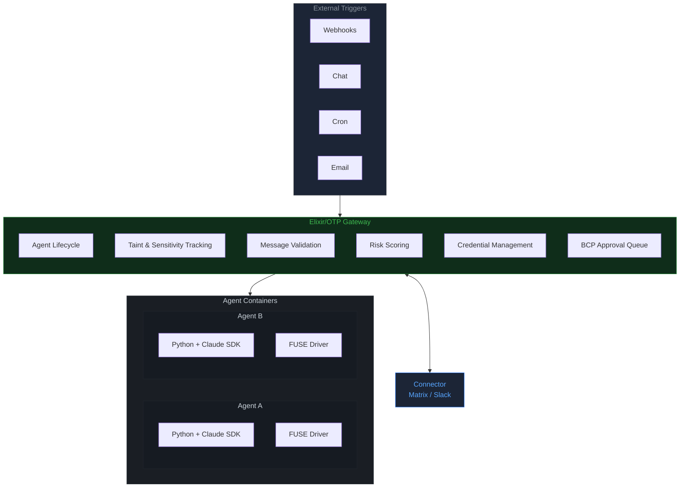

---
hide:
  - toc
---

<div class="tx-hero" markdown>
<div class="tx-hero__content" markdown>

# TriOnyx

<p class="tx-hero__tagline">track what agents see, not just what they do</p>

<p class="tx-hero__subtitle">
A security-first agent runtime that tracks <strong>information flow</strong> between isolated LLM agents.
Taint tracking, sensitivity labels, and bandwidth-constrained communication &mdash;
built on Elixir/OTP for a single operator running their own agents.
</p>

<div class="tx-hero__actions">
  <a href="getting-started/" class="md-button md-button--primary">Get Started</a>
  <a href="agent-runtime/" class="md-button md-button--secondary">Architecture</a>
</div>

</div>
</div>

<div class="tx-section-header" markdown>

## The lethal trifecta

The term comes from [Simon Willison's "The Lethal Trifecta"](https://simonwillison.net/2025/Jun/16/the-lethal-trifecta/) &mdash; the observation that AI agents become critically dangerous when they combine access to private data, exposure to untrusted content, and the ability to communicate externally. TriOnyx was built to address this directly.

Other agent runtimes sandbox **capability** &mdash; restrict filesystem, disable shell, limit network.
This misses the point. The real danger isn't any single property of an agent. It's the combination of three.

</div>

<div class="tx-trifecta">
  <div class="tx-trifecta__card">
    <div class="tx-trifecta__icon">&#x2623;</div>
    <div class="tx-trifecta__title">Untrusted content</div>
    <div class="tx-trifecta__desc">Web pages, emails, API responses &mdash; any of which can carry prompt injections.</div>
  </div>
  <div class="tx-trifecta__op">&times;</div>
  <div class="tx-trifecta__card">
    <div class="tx-trifecta__icon">&#x1F511;</div>
    <div class="tx-trifecta__title">Sensitive information</div>
    <div class="tx-trifecta__desc">Credentials, private files, internal APIs &mdash; things an attacker wants to reach.</div>
  </div>
  <div class="tx-trifecta__op">&times;</div>
  <div class="tx-trifecta__card">
    <div class="tx-trifecta__icon">&#x26A1;</div>
    <div class="tx-trifecta__title">Capabilities</div>
    <div class="tx-trifecta__desc">Shell access, file writes, inter-agent messaging &mdash; tools to act on a hijacked context.</div>
  </div>
</div>

<div class="tx-trifecta-equals">
  <div class="tx-trifecta-equals__op">=</div>
  <div class="tx-trifecta-equals__card">
    <div class="tx-trifecta-equals__headline">High-risk agent</div>
    <div class="tx-trifecta-equals__desc">TriOnyx tracks <strong>information</strong>, not just capability &mdash; blocking tainted data from reaching sensitive resources.</div>
  </div>
</div>

## Architecture



<div style="text-align: center; margin-top: -0.5rem; margin-bottom: 2rem;">
<small style="color: #8b949e;">
<strong>Gateway</strong> &mdash; Non-agentic control plane. No LLM. No autonomy. Deterministic security boundary.<br/>
<strong>Agents</strong> &mdash; Python + Claude SDK inside Docker. Communicate with the gateway over JSON Lines.<br/>
<strong>FUSE</strong> &mdash; Go driver enforcing per-file read/write policies. Logs all access.<br/>
<strong>Connector</strong> &mdash; Bridges the gateway to Matrix, Slack, or email.
</small>
</div>

<div class="tx-section-header" markdown>

## Features

</div>

<div class="tx-features">
<div class="tx-feature"><span class="tx-feature__icon">&#x1F4E6;</span><h3>Isolated containers</h3><p>Each agent runs in its own Docker container with a per-agent FUSE filesystem, network rules, and no shared state.</p></div>
<div class="tx-feature"><span class="tx-feature__icon">&#x1F6E1;</span><h3>Taint tracking</h3><p>Biba integrity model tracks what each agent has been exposed to. Untrusted web data, user uploads, and API responses all carry taint.</p></div>
<div class="tx-feature"><span class="tx-feature__icon">&#x1F512;</span><h3>Sensitivity labels</h3><p>Bell-LaPadula confidentiality tracks access to secrets, credentials, and private data. The two axes are independent.</p></div>
<div class="tx-feature"><span class="tx-feature__icon">&#x1F504;</span><h3>Information flow enforcement</h3><p>The gateway intercepts all inter-agent messages and blocks flows that violate integrity or confidentiality constraints.</p></div>
<div class="tx-feature"><span class="tx-feature__icon">&#x1F4AC;</span><h3>Bandwidth-Constrained Protocol</h3><p>Tainted agents communicate with clean agents through structured, bandwidth-limited, human-approvable message formats.</p></div>
<div class="tx-feature"><span class="tx-feature__icon">&#x1F4C2;</span><h3>FUSE filesystem</h3><p>Custom Go driver enforces per-file read/write policies inside each container. O(1) path-trie lookups, structured access logging.</p></div>
<div class="tx-feature"><span class="tx-feature__icon">&#x1F310;</span><h3>Browser sessions</h3><p>Agents can get a headless Chromium browser with persistent login sessions from the host. No credential sharing.</p></div>
<div class="tx-feature"><span class="tx-feature__icon">&#x1F9E9;</span><h3>Plugin system</h3><p>Reusable agent extensions (news aggregation, bookmarks, diary) installable from git repos with FUSE-enforced access.</p></div>
<div class="tx-feature"><span class="tx-feature__icon">&#x1F50D;</span><h3>Auditable everything</h3><p>Structured logs for file access, tool calls, message routing, and policy violations. Queryable audit API.</p></div>
</div>

!!! tip "New here?"
    Start with the [Getting Started guide](getting-started.md) for a complete walkthrough,
    or read the [Comparison with OpenClaw](comparison.md) to understand the security model.

## Quick start

=== "Build"

    ```bash
    # Gateway image (Elixir/OTP)
    docker build -f gateway.Dockerfile -t tri-onyx-gateway:latest .

    # Agent runtime image (Python + FUSE sandbox)
    docker build -f agent.Dockerfile -t tri-onyx-agent:latest .

    # Connector image (Python, for Matrix chat bridge)
    docker build -f connector.Dockerfile -t connector:latest .
    ```

    The agent image requires a pre-built FUSE driver binary at `fuse/tri-onyx-fs`.
    See the [FUSE Driver spec](fuse-driver-spec.md) for build instructions.

=== "Run"

    ```bash
    docker compose up
    ```

    Or run the gateway standalone:

    ```bash
    docker run --rm -p 4000:4000 \
      -v $(pwd):/app -w /app \
      -v /var/run/docker.sock:/var/run/docker.sock \
      -e TRI_ONYX_HOST_ROOT=$(pwd) \
      --env-file .env \
      tri-onyx-gateway:latest mix run --no-halt
    ```

=== "Test"

    ```bash
    # Elixir gateway tests
    docker run --rm -v $(pwd):/app -w /app \
      tri-onyx-gateway:latest mix test

    # Go FUSE driver tests
    docker run --rm --device /dev/fuse --cap-add SYS_ADMIN \
      --security-opt apparmor=unconfined \
      -v $(pwd)/fuse:/src -w /src golang:1.22 \
      bash -c "apt-get update -qq && \
        apt-get install -y -qq fuse3 2>/dev/null && \
        go test ./..."

    # Python connector tests
    docker run --rm -v $(pwd)/connector:/app -w /app \
      connector:latest uv run pytest
    ```
