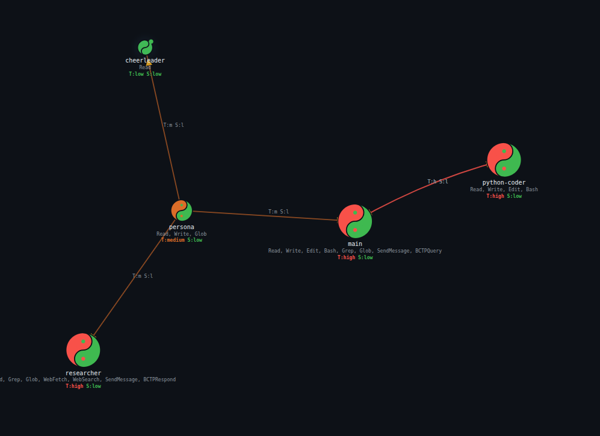

# TriOnyx -- What OpenClaw would be if security came first

A complete agent runtime that tracks what agents have *seen*, not just what they can *do*.



## The core problem

OpenClaw sandboxes **capability** -- restrict filesystem access, disable shell, limit network. This misses the point. An LLM that has ingested a prompt injection is dangerous regardless of what tools it has. The real threat is **information**: what enters an agent's context, and where it flows next.

## What TriOnyx does

- **Isolated agent containers** -- each agent runs in its own Docker container with a per-agent FUSE filesystem, network rules, and no shared state
- **Taint and sensitivity tracking** -- two independent axes (Biba integrity, Bell-LaPadula confidentiality) that measure what each agent has been exposed to
- **Information flow enforcement** -- the gateway intercepts all inter-agent communication and blocks flows that would violate integrity or confidentiality constraints
- **Bandwidth-Constrained Protocol** -- tainted agents can communicate with clean agents through structured, human-approvable message formats
- **Browser sessions** -- agents can get a headless Chromium browser with persistent login sessions from the host
- **Plugin system** -- reusable agent extensions (news aggregation, bookmarks, diary, etc.) installable from git repos
- **Web dashboard** -- real-time agent topology graph, classification matrix, and log viewer
- **Auditable everything** -- structured logs for file access, tool calls, message routing, and policy violations
- **Risk reduction, not elimination** -- the security model makes attacks harder and detectable, not theoretically impossible

Built on Elixir/OTP. Designed for a single operator running their own agents.

## Architecture

```
                External Triggers
                (webhooks, chat, cron, email)
                        |
                        v
+------------------------------------------+
|          Elixir/OTP Gateway              |
|                                          |
|  * Agent lifecycle (supervision trees)   |
|  * Taint & sensitivity tracking          |
|  * Message interception & validation     |
|  * Risk scoring & violation detection    |
|  * Credential management (sole holder)   |
|  * Graph analysis (transitive risk)      |
|  * BCP approval queue                    |
|  * Webhook receiver & routing            |
|  * Cron scheduler & heartbeats           |
|                                          |
|  Non-agentic. No LLM. No autonomy.      |
|  Deterministic security boundary.        |
+---------+--------------+-----------------+
          |              |
          v              v
+-------------+  +-------------+       +-------------+
| Agent A     |  | Agent B     |       | Connector   |
|             |  |             |       | (Python)    |
| Python +    |  | Python +    |       |             |
| Claude SDK  |  | Claude SDK  |       | Matrix      |
|             |  |             |       | adapter     |
| +---------+ |  | +---------+ |       +-------------+
| |FUSE     | |  | |FUSE     | |
| |Driver   | |  | |Driver   | |
| |(Go)     | |  | |(Go)     | |
| +---------+ |  | +---------+ |
| Docker      |  | Docker      |
| Container   |  | Container   |
+-------------+  +-------------+
```

**Gateway (Elixir/OTP)** -- Non-agentic control plane. Manages agent lifecycles, intercepts all inter-agent messages, tracks information exposure, computes risk scores, enforces security policies, and routes webhooks, emails, and scheduled triggers.

**Agent Runtime (Python)** -- Drives Claude sessions via the Claude Agent SDK inside Docker containers. Communicates with the gateway over JSON Lines on stdin/stdout. Optionally runs a headless browser for web interaction.

**FUSE Driver (Go)** -- Passthrough filesystem enforcing per-file read/write policies inside each container. Logs all access and denials as structured events.

**Connector (Python)** -- Bridges the gateway to chat platforms via WebSocket. Currently supports Matrix.

**Web Dashboard** -- Static HTML frontends served by the gateway for monitoring agent topology, classification matrices, and session logs.

**New here?** Start with the [Getting Started guide](getting-started.md) for a complete walkthrough.

## Quick start

### Prerequisites

- Docker

### Build

```bash
# Gateway image (Elixir/OTP)
docker build -f gateway.Dockerfile -t tri-onyx-gateway:latest .

# Agent runtime image (Python + FUSE sandbox)
docker build -f agent.Dockerfile -t tri-onyx-agent:latest .

# Connector image (Python, for Matrix chat bridge)
docker build -f connector.Dockerfile -t connector:latest .
```

The agent image requires a pre-built FUSE driver binary at `fuse/tri-onyx-fs`. See `fuse/README.md` for build instructions.

### Run

```bash
docker compose up
```

Or run the gateway standalone:

```bash
docker run --rm -p 4000:4000 \
  -v $(pwd):/app -w /app \
  -v /var/run/docker.sock:/var/run/docker.sock \
  -e TRI_ONYX_HOST_ROOT=$(pwd) \
  --env-file .env \
  tri-onyx-gateway:latest mix run --no-halt
```

`TRI_ONYX_HOST_ROOT` tells the gateway the real host path so that agent container bind mounts resolve correctly.

### Test

```bash
# Elixir gateway tests
docker run --rm -v $(pwd):/app -w /app tri-onyx-gateway:latest mix test

# Go FUSE driver tests
docker run --rm --device /dev/fuse --cap-add SYS_ADMIN \
  --security-opt apparmor=unconfined \
  -v $(pwd)/fuse:/src -w /src golang:1.22 \
  bash -c "apt-get update -qq && apt-get install -y -qq fuse3 2>/dev/null && go test ./..."

# Python connector tests
docker run --rm -v $(pwd)/connector:/app -w /app connector:latest uv run pytest
```
