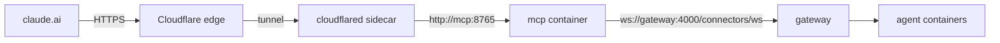

# MCP Server

A separate container that exposes a small, fixed set of TriOnyx agents to
[claude.ai custom connectors](https://claude.ai) over the Model Context Protocol.
It is the only part of TriOnyx that is reachable from the public internet, and it
is built so that **only the operator can ever authorize access**.



Nothing listens on a public port. `cloudflared` dials **out** to Cloudflare and
forwards inbound requests over the compose network; the `mcp` service publishes
only `127.0.0.1:8765` for local testing.

## Architecture

| Piece | Where | Role |
| --- | --- | --- |
| `mcp_server/mcp_server/config.py` | container | YAML config with `${VAR}` interpolation (helper imported from the connector package) |
| `mcp_server/mcp_server/auth.py` | container | OAuth 2.1 policy: operator login, codes, tokens, rotation |
| `mcp_server/mcp_server/storage.py` | container | Hashed, atomically-written token store under `/data` |
| `mcp_server/mcp_server/gateway_bridge.py` | container | Collapses a streaming gateway turn into one MCP tool result and keeps a long turn running in the background across tool calls |
| `mcp_server/mcp_server/server.py` | container | Tools, login page, ASGI app |
| `mcp.Dockerfile` | build | `python:3.12-slim`, uv, non-root |
| `docker-compose.yml` (`mcp`, `cloudflared`) | host | Both behind the `mcp` profile |

The wire protocol to the gateway is **not** re-implemented: the container
installs the existing `connector` package and reuses
`connector.protocol` and `connector.gateway_client.GatewayClient` (registration,
reconnect/backoff, health pings). The only change to the connector package was
making the register frame's `platform` a parameter (it was hardcoded to
`matrix`) and adding an optional `on_disconnect` callback.

### The tool surface

One tool per allowlisted agent — the tool list *is* the agent directory:

- **`<agent_name>(message, conversation_id?)`** — forwards the message to that
  agent and returns its reply. The tool's description is the agent's
  `description` from `secrets/mcp-config.yaml`, so the remote client sees what
  each agent is for without a discovery call.
- The allowlist comes from the config, *not* from the gateway: the remote
  client never learns which other agents exist, and a non-allowlisted agent
  simply has no tool — there is no name parameter to probe.
- Agent names are mapped onto the MCP tool-name charset (`[A-Za-z0-9_-]`,
  anything else becomes `_`); two agents that sanitize to the same tool name
  are a startup configuration error.

### Conversations and sessions

The gateway keys agent sessions by `agent_name:hash(channel)`, so a stable
channel gives a persistent session. Each agent tool maps its `conversation_id`
onto the channel's `room_id`:

```
room_id = "<room_prefix>-<sanitized conversation_id>"      # default: "mcp-default"
```

The id is stripped to `[A-Za-z0-9_-]`, truncated to 64 characters, and prefixed
(`mcp-` by default), so an MCP conversation can never collide with a Matrix or
Slack room and cannot be used to smuggle path-like values. Reusing a
`conversation_id` continues the same agent session; a new one starts fresh.

The gateway streams a turn's answer as `agent_text` frames terminated by
`agent_result`, and the bridge collapses that into one string.

### Long turns

A turn can far outlive the tool call that started it — the first message to an
agent syncs its git repos and boots a container, which can take minutes, while
the MCP client's own tool-call timeout is much shorter. The bridge therefore
runs each `(agent, conversation)` key through a small state machine:

| State | Meaning | Left by |
| --- | --- | --- |
| idle | no turn | a call sends its message and starts a turn |
| running | turn in flight | `agent_result`/`agent_error`, or the hard timeout |
| parked | finished, reply uncollected | the next call collects it, or the TTL expires it |

- A tool call waits up to `session.soft_timeout_seconds` (default **50 s**). If
  the reply is not in by then, the call returns a `[TriOnyx: still working]`
  notice — a *successful* result carrying elapsed time and last-known activity
  (session starting / agent thinking / running tool X) — and the turn keeps
  running.
- A later call on the same key **attaches** to the running turn. Its message is
  a poll and is *not* forwarded: the gateway FIFO-queues prompts per session,
  so forwarding would enqueue a second prompt and desynchronise the
  one-turn-per-key correlation. This also means a genuinely new message sent
  mid-turn is dropped in favour of the previous reply — the notice warns the
  calling model about exactly this.
- A reply (or error) that lands with nobody waiting is parked and delivered to
  the next call; uncollected results are swept after
  `session.parked_result_ttl_seconds` (default **600 s**). A background turn is
  abandoned with an error after `session.timeout_seconds` (default **300 s**)
  even if no caller is attached, so the worst-case lifetime of a key is
  `timeout_seconds + parked_result_ttl_seconds`.
- Caller cancellation (the client hanging up mid-call) does not cancel the
  turn — the bridge waits with `asyncio.wait`, never `asyncio.wait_for`, which
  is what keeps the turn alive. A dropped gateway connection fails running
  turns (the error is parked for the next poll); already-parked replies
  survive.

**Tuning:** `soft_timeout_seconds` is the one knob tied to the MCP client's
undocumented tool-call timeout. If callers see transport errors instead of the
still-working notice, lower it; every early return logs the elapsed time, so
the real client timeout can be measured from production logs. Config changes
are restart-only (`docker compose --profile mcp up -d mcp`), no rebuild.

Every forwarded message carries `trust: {level: verified, sender: mcp-operator}`
— the operator is the only principal that can be behind a valid token.

## Security model

The threat is simple to state: the endpoint is public, so anyone can reach
`/register`, `/authorize` and `/token`. The design makes that harmless.

### Only the operator can authorize

Dynamic Client Registration is open — the MCP spec requires it, and claude.ai
depends on it. Registration grants **nothing**. A registered client gets an
`/authorize` request parked server-side and is redirected to `/login`, an
interactive page where a single high-entropy secret (`MCP_OPERATOR_PASSWORD`)
must be entered. No password, no authorization code, ever. The comparison is
`hmac.compare_digest`; the page never hints at how close an attempt was.

Because registration is unauthenticated, the client store is bounded: at
`max_registered_clients` (default 10) the oldest registration without live
tokens is evicted, and tokenless registrations older than `client_ttl_seconds`
(default 30 days) are pruned. A client that holds live tokens is never evicted.

### The login is bound to the initiating browser

The `/authorize` redirect sets an `mcp_txn` cookie (`HttpOnly; Secure;
SameSite=Lax; Path=/login`) mirroring the parked transaction id. `/login`
refuses any transaction the presenting browser does not hold the cookie for.
This closes the pre-staged-transaction phish: an attacker who starts an OAuth
flow from their own claude.ai account and lures the operator to the genuine
login link gets nothing — the operator's browser lacks the attacker's cookie.
The consent page also shows the client id prefix and the exact redirect URI,
not just the self-asserted client name.

A password is only ever evaluated against a live pending transaction: without
one, `POST /login` is rejected before the comparison, so an attacker must pay
an `/authorize` round-trip (and hold the matching cookie) per guess.

### Brute-force protection

- **Per IP:** 5 failures → 15-minute lockout (`max_login_failures`,
  `lockout_seconds`). A correct password is refused while locked out.
- **Globally:** beyond `global_failure_threshold` failures in the window, every
  attempt is delayed with exponential backoff capped at
  `global_backoff_max_seconds`. A *delay* rather than a lockout, deliberately —
  a global lockout would let anyone who knows the URL lock the operator out.
  Password evaluations run under a small concurrency semaphore, so the delay is
  an actual throughput limit, not just per-request latency.
- The per-IP table is swept (stale sub-threshold entries dropped) and
  hard-capped, so rotating source addresses cannot grow it without bound.

Client addresses come from `CF-Connecting-IP` / `X-Forwarded-For`, which are
only as trustworthy as the tunnel — which is exactly why the global backoff
exists alongside the per-IP rule.

### Tokens

| Property | Access token | Refresh token |
| --- | --- | --- |
| Entropy | `secrets.token_urlsafe(32)` | `secrets.token_urlsafe(32)` |
| Lifetime | 1 h (`access_token_ttl_seconds`) | 30 d absolute (`refresh_token_ttl_seconds`) |
| At rest | SHA-256 hash only | SHA-256 hash only |
| On refresh | rotated, old one revoked | rotated, old one consumed atomically |

The store file therefore contains no usable credential. A replayed refresh token
gets the standard RFC 6749 `invalid_grant`. Refreshing does not extend the
absolute lifetime — after 30 days the operator logs in again.

Authorization codes are single-use, expire in ≤5 minutes, and are bound to the
client, the redirect URI, the PKCE challenge and the RFC 8707 `resource`.

### Protocol conformance

- **RFC 9728** — an unauthenticated (or bad-token) request to `/mcp` gets `401`
  with `WWW-Authenticate: Bearer …, resource_metadata="…"`, not a 200 with an
  MCP error. The metadata document is served at both
  `/.well-known/oauth-protected-resource/mcp` (the path-inserted form the header
  points at) and `/.well-known/oauth-protected-resource`.
- **RFC 7636** — PKCE `S256` only; `code_challenge_methods_supported` advertises
  `["S256"]` and the SDK rejects `plain` and missing challenges.
- **RFC 8707** — the `resource` parameter is validated against this server's
  canonical URL (`https://host/mcp`, or the bare origin) at `/authorize`, bound
  into the issued token's audience, and re-checked on every bearer verification.
  A token minted for another audience is rejected.
- **RFC 7591** — `/register` accepts JSON; `/token` accepts
  `application/x-www-form-urlencoded`. `redirect_uris` are checked against the
  allowlist at registration *and* at authorization, so narrowing the allowlist
  takes effect for already-registered clients.
- Discovery, registration and token endpoints do no I/O beyond a small local
  file, so they answer in milliseconds — well inside claude.ai's 10 s budget.

### Container hardening

`python:3.12-slim`, runs as a non-root uid (`HOST_UID`, default 1000, so it can
write the host-owned data dir), `no-new-privileges`, no Docker socket, no
workspace mounts. The only mounts are the source (read-only), the config
(read-only) and `/data`. Public URLs are generated from `public_url`, never from
Host headers.

The internet-facing pair is network-isolated: `cloudflared` sits alone with
`mcp` on the `mcp_edge` network, and `mcp` reaches the gateway over the
internal-only `mcp_internal` network. A routing typo in the Cloudflare
dashboard therefore cannot publish the gateway's unauthenticated webhook
endpoint or the debug frontend — those services aren't reachable from the
tunnel container at all.

Messages sent through an agent tool must not start with `/` (except
`/library:action` skill syntax): the gateway parses leading-slash content as
operator system commands (e.g. `/restart <agent>`) before routing, which would
otherwise bypass the agent allowlist.

### Logging

Auth failures, client registrations, token issuance and every tool invocation
(agent name + truncated message) go to stdout. Passwords, tokens and
`Authorization` headers are never logged, and uvicorn's access log is disabled
because query strings carry the single-use login transaction id.

## Setup

### 1. Secrets

Add to `.env` (both are read by `docker-compose.yml`):

```dotenv
# Cloudflare Tunnel token (from the dashboard, step 2)
TUNNEL_TOKEN=

# The single credential that authorizes an MCP connector.
# Generate with: openssl rand -base64 32
MCP_OPERATOR_PASSWORD=

# Public origin of the tunnel, no trailing slash
MCP_PUBLIC_URL=https://mcp.example.com
```

`TRI_ONYX_CONNECTOR_TOKEN` is already there — the MCP server reuses it.

### 2. Cloudflare Tunnel

1. Cloudflare dashboard → **Zero Trust → Networks → Tunnels → Create a tunnel**
   → *Cloudflared*.
2. Name it (e.g. `trionyx-mcp`) and copy the **tunnel token** into `TUNNEL_TOKEN`.
   Do not run the install command it offers — the sidecar does that.
3. **Public Hostname** tab → add a hostname:
   - Subdomain/domain: whatever `MCP_PUBLIC_URL` points at, e.g. `mcp.example.com`
   - Service: **HTTP** → `mcp:8765`
4. Save. Routing lives in the dashboard, not in `docker-compose.yml`.

Optionally add a Cloudflare Access policy in front of the hostname for a second
factor. The operator password is required either way.

### 3. Config and data directory

```bash
cp secrets/mcp-config.yaml.example secrets/mcp-config.yaml
mkdir -p secrets/mcp-data          # must exist and be owned by your uid
$EDITOR secrets/mcp-config.yaml    # edit the `agents:` allowlist
```

The `agents:` list is the whole ACL. Only names listed there are reachable, and
their descriptions are what the remote model sees.

### 4. Start

```bash
docker compose --profile mcp up -d --build mcp cloudflared
docker compose logs -f mcp
```

Both services sit behind the `mcp` compose profile, so a plain
`docker compose up` is unaffected until you opt in.

Local smoke check (no tunnel needed):

```bash
curl -s http://127.0.0.1:8765/healthz
curl -s http://127.0.0.1:8765/.well-known/oauth-protected-resource
curl -si -X POST http://127.0.0.1:8765/mcp \
  -H 'Content-Type: application/json' \
  -H 'Accept: application/json, text/event-stream' \
  -d '{"jsonrpc":"2.0","id":1,"method":"tools/list"}' | head -5
```

The last one must be `401` with a `WWW-Authenticate: Bearer …` header.

### 5. Connect claude.ai

1. claude.ai → **Settings → Connectors → Add custom connector**.
2. URL: `https://mcp.example.com/mcp` (the `MCP_PUBLIC_URL` + `/mcp`).
3. Claude registers itself, then opens the TriOnyx sign-in page.
4. Enter the `MCP_OPERATOR_PASSWORD`. On success you are redirected back and the
   connector goes live.
5. Verify in a chat: the connector's tools are the allowlisted agents — ask
   Claude to send one of them a message.

## Operations

### Rotating the operator password

1. Generate a new one: `openssl rand -base64 32`.
2. Update `MCP_OPERATOR_PASSWORD` in `.env`.
3. Restart: `docker compose --profile mcp up -d mcp`.

Rotation does **not** invalidate tokens that were already issued — it only
changes what future authorizations require. To also cut off existing access,
delete the store and restart:

```bash
rm -f secrets/mcp-data/oauth-store.json
docker compose --profile mcp restart mcp
```

Every connector then has to re-authorize with the new password. This is also the
break-glass procedure if you suspect a token leaked.

### Revoking a single connector

There is no admin UI. Deleting the store (above) revokes everything; that is the
intended granularity for a single-operator system.

### Adding or removing an agent

Edit `agents:` in `secrets/mcp-config.yaml` and restart the `mcp` service. No
gateway change is needed — the gateway never learns which agents the connector
exposes.

### Where things live

- Config: `secrets/mcp-config.yaml` (gitignored; template at
  `secrets/mcp-config.yaml.example`)
- OAuth state: `secrets/mcp-data/oauth-store.json` (hashed; safe to delete)
- Logs: `docker compose --profile mcp logs mcp`

## Implementation notes

- MCP SDK: pinned to `mcp==2.0.0` with a committed `uv.lock` (the image builds
  with `uv sync --locked`) — this dependency is the OAuth enforcement layer, so
  upgrades are deliberate: bump, re-run the test suite, re-verify the login
  flow. In 2.x the `FastMCP` class is `MCPServer`
  (`from mcp.server.mcpserver import MCPServer`) and `mcp.server.fastmcp` no
  longer exists. The SDK serves `/.well-known/oauth-authorization-server`,
  `/authorize`, `/token` and `/register` from an
  `OAuthAuthorizationServerProvider`; this repo supplies the provider, the login
  page and the storage.
- Transport: streamable HTTP at `/mcp`. The deprecated SSE transport is not
  implemented.
- Runtime source is bind-mounted (`./mcp_server/mcp_server`,
  `./connector/connector`), so Python changes take effect on container restart —
  rebuild only when `mcp.Dockerfile` or the dependency list changes.
