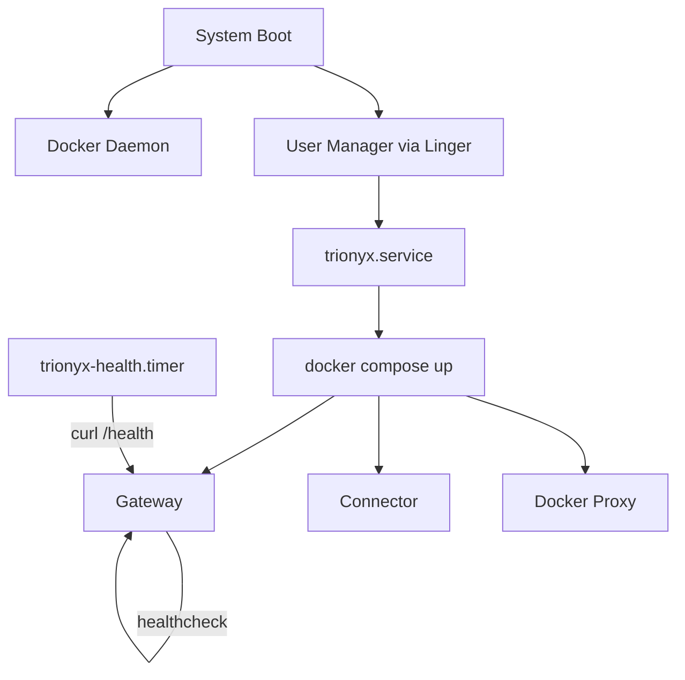

# Running as a Service

This guide configures TriOnyx to run as an always-on service that starts on boot, restarts on failure, and survives logout. It uses a **systemd user service** combined with Docker Compose restart policies for two layers of resilience.

---

## Prerequisites

- A working TriOnyx installation (see [Getting Started](getting-started.md))
- Linux with systemd (Ubuntu 20.04+, Debian 11+, Fedora 34+, etc.)
- Docker Engine with `docker compose` v2

---

## How it works

The setup has two layers:

| Layer | Handles | Mechanism |
|-------|---------|-----------|
| **Container** | Individual service crashes (gateway OOM, connector disconnect) | Docker `restart: unless-stopped` |
| **System** | Full stack lifecycle (boot start, Docker daemon restart, compose crash) | systemd user service |

The gateway's built-in health check (`GET /health`) drives both layers — Docker uses it to detect unhealthy containers, and an optional systemd timer monitors overall availability.



---

## 1. Enable restart policies

The `docker-compose.yml` should have restart policies and a health check on the gateway. These are included by default:

```yaml
services:
  gateway:
    restart: unless-stopped
    healthcheck:
      test: ["CMD", "curl", "-sf", "http://127.0.0.1:4000/health"]
      interval: 30s
      timeout: 5s
      retries: 3
      start_period: 60s
    # ...

  connector:
    restart: unless-stopped
    depends_on:
      gateway:
        condition: service_healthy
    # ...

  docker-proxy:
    restart: unless-stopped
    # ...
```

The `start_period` gives the gateway 60 seconds to compile dependencies and boot the OTP application before health checks begin. The connector waits for the gateway to be healthy before starting.

---

## 2. Create the systemd user service

Create the unit file:

```bash
mkdir -p ~/.config/systemd/user
```

```ini title="~/.config/systemd/user/trionyx.service"
[Unit]
Description=TriOnyx Agent Gateway
After=network-online.target

[Service]
Type=simple
WorkingDirectory=/home/<your-user>/Repositories/TriOnyx
ExecStart=/usr/bin/docker compose up
ExecStop=/usr/bin/docker compose down --timeout 30
Restart=on-failure
RestartSec=10
TimeoutStopSec=45
Environment=PWD=/home/<your-user>/Repositories/TriOnyx
StandardOutput=journal
StandardError=journal
SyslogIdentifier=trionyx

[Install]
WantedBy=default.target
```

!!! warning "Update the paths"
    Replace `/home/<your-user>/Repositories/TriOnyx` with your actual project path in both `WorkingDirectory` and `Environment=PWD=...`. The `PWD` variable is required because `docker-compose.yml` uses `${PWD}` for bind mount paths.

Key design decisions:

- **`docker compose up` without `-d`** — runs in the foreground so systemd can track the process directly
- **`Restart=on-failure`** — only restarts on crashes, not on clean `systemctl --user stop`
- **`RestartSec=10`** — prevents tight restart loops if Docker isn't ready yet
- **`TimeoutStopSec=45`** — gives containers 30 seconds for graceful shutdown (agent cleanup, session logging)
- **No `--build`** — rebuild manually with `docker compose build` when Dockerfiles change

---

## 3. Create the health check timer (optional)

A systemd timer that checks `/health` every 5 minutes. Failed checks appear in the journal, making it easy to spot intermittent issues or hook up alerting later.

```ini title="~/.config/systemd/user/trionyx-health.service"
[Unit]
Description=TriOnyx health check
After=trionyx.service

[Service]
Type=oneshot
ExecStart=/bin/bash -c 'response=$(curl -sf http://127.0.0.1:4000/health 2>&1) && echo "TriOnyx healthy: $response" || (echo "TriOnyx health check FAILED: $response" && exit 1)'
```

```ini title="~/.config/systemd/user/trionyx-health.timer"
[Unit]
Description=TriOnyx health check timer

[Timer]
OnCalendar=*:0/5
Persistent=true

[Install]
WantedBy=timers.target
```

---

## 4. Enable linger

By default, systemd stops user services when the user logs out. Linger makes them persist and start at boot:

```bash
sudo loginctl enable-linger $(whoami)
```

Verify with:

```bash
loginctl show-user $(whoami) | grep Linger
# Linger=yes
```

This is the only step that requires `sudo`.

---

## 5. Enable and start

```bash
# Reload unit files
systemctl --user daemon-reload

# Enable (auto-start on boot) and start now
systemctl --user enable --now trionyx.service

# Enable the health timer (optional)
systemctl --user enable --now trionyx-health.timer
```

Verify it's running:

```bash
systemctl --user status trionyx
```

---

## Daily operations

```bash
# Service status
systemctl --user status trionyx

# Live logs (all services)
journalctl --user -u trionyx -f

# Logs since last boot
journalctl --user -u trionyx -b

# Restart (e.g., after config changes)
systemctl --user restart trionyx

# Stop
systemctl --user stop trionyx

# Health check history
journalctl --user -u trionyx-health --since "1 hour ago"

# List active timers
systemctl --user list-timers
```

!!! tip "Rebuilding images"
    After changing Dockerfiles or Go code, rebuild before restarting:
    ```bash
    docker compose build
    systemctl --user restart trionyx
    ```
    For runtime-only changes (Python files in `runtime/`), a restart is enough — no rebuild needed.

---

## How failures are handled

| Failure | Recovery |
|---------|----------|
| Gateway container crashes | Docker restarts it (`restart: unless-stopped`) |
| Connector container crashes | Docker restarts it; waits for gateway health |
| Docker daemon restarts | systemd restarts `docker compose up` via `Restart=on-failure` |
| Machine reboots | systemd starts the service at boot via linger |
| Gateway hangs (no crash) | Docker healthcheck marks it unhealthy after 3 failed checks (90s), then restarts |

The gateway's `Application.start/2` includes orphaned container cleanup, so agent containers from a previous crash are cleaned up automatically on restart.

---

## Disabling the service

To stop running TriOnyx on boot:

```bash
systemctl --user disable --now trionyx.service
systemctl --user disable --now trionyx-health.timer
```

---

## Troubleshooting

??? question "Service fails immediately on start"
    Check the journal for errors:
    ```bash
    journalctl --user -u trionyx --since "5 min ago"
    ```
    Common causes:

    - Docker daemon not running (`systemctl status docker`)
    - Missing `.env` file or secrets
    - Port 4000 already in use (`ss -tlnp | grep 4000`)

??? question "Service starts but connector won't connect"
    The connector now waits for the gateway to be healthy (via `depends_on: condition: service_healthy`). If the gateway takes longer than 60 seconds to start (the `start_period`), the connector may fail.

    Check gateway health manually:
    ```bash
    docker compose ps
    curl -s http://127.0.0.1:4000/health
    ```

??? question "Service doesn't start after reboot"
    Verify linger is enabled:
    ```bash
    loginctl show-user $(whoami) | grep Linger
    ```
    If `Linger=no`, re-run `sudo loginctl enable-linger $(whoami)`.

    Also check that the service is enabled:
    ```bash
    systemctl --user is-enabled trionyx
    ```

??? question "Logs are too verbose"
    Docker Compose outputs all container logs to stdout, which systemd captures. To filter:
    ```bash
    # Only gateway logs
    journalctl --user -u trionyx -f | grep gateway

    # Or use docker directly
    docker compose logs -f gateway
    ```

??? question "User systemd can't depend on Docker"
    User-mode systemd units cannot formally depend on system units like `docker.service`. The `Restart=on-failure` with `RestartSec=10` handles this — if Docker isn't ready yet, the service retries after 10 seconds. In practice, Docker starts well before user services on a standard setup.
